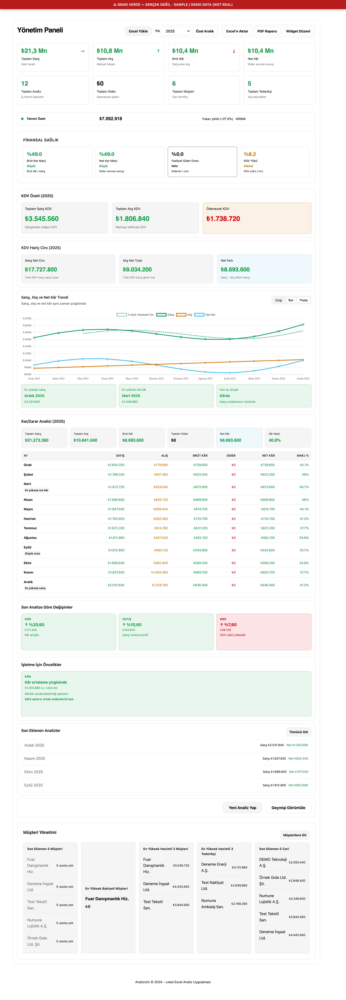
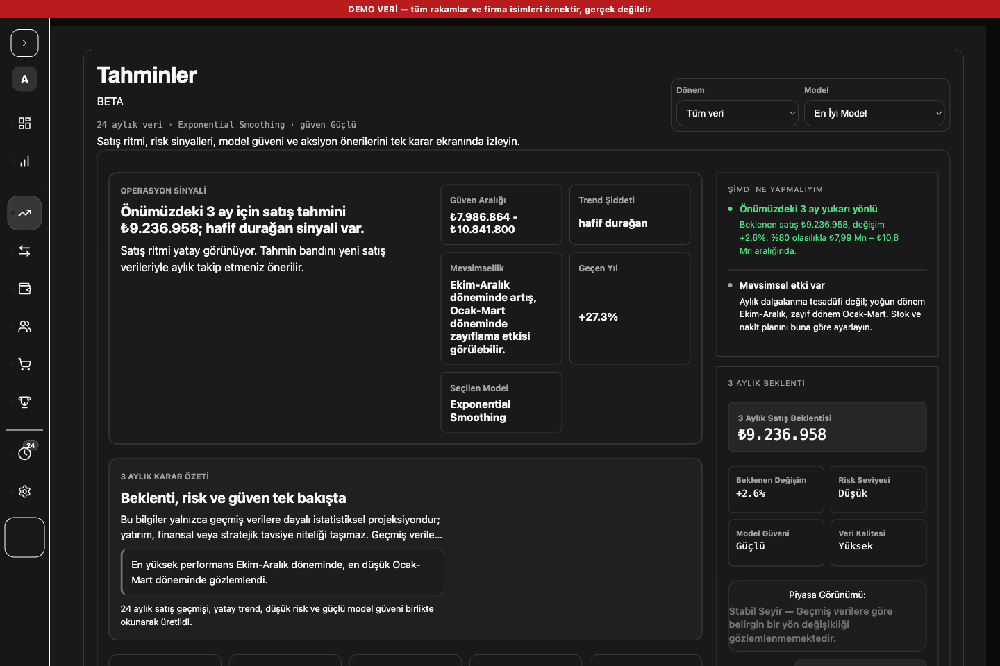
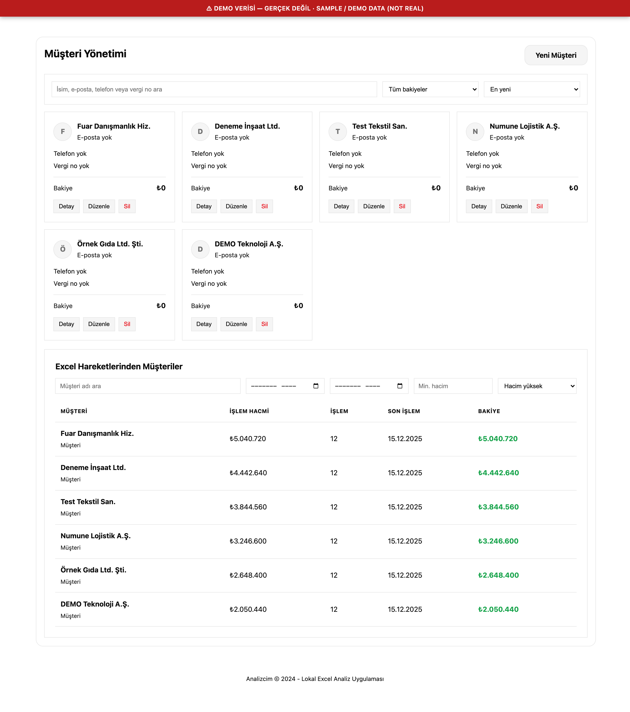

# Analizcim

[](https://github.com/ademtfkc/analizcim/actions/workflows/ci.yml)
[](LICENSE)

Lokal Excel verileriyle çalışan; satış, alış, kâr, KDV, gider ve tahmin analizlerini daha anlaşılır
hale getiren, karar odaklı bir finansal analiz uygulaması. Finansal veriler kullanıcının kendi
makinesinde kalır.

> Dashboard ve Tahminler sayfaları yalnızca veri sunmaz; "durum ne, risk nerede, şimdi ne yapmalıyım?"
> sorularına cevap vermeyi hedefler.

## İçindekiler

- [Kimler İçin?](#kimler-için)
- [Temel Özellikler](#temel-özellikler)
- [Ekran Görüntüleri](#ekran-görüntüleri)
- [Teknolojiler](#teknolojiler)
- [Kurulum ve Çalıştırma](#kurulum-ve-çalıştırma)
- [Proje Yapısı](#proje-yapısı)
- [Cari Yönetimi (Müşteri / Tedarikçi)](#cari-yönetimi-müşteri--tedarikçi)
- [Dashboard](#dashboard)
- [Yıl Karşılaştırma](#yıl-karşılaştırma)
- [Tahminler](#tahminler)
- [Geliştirme ve Test](#geliştirme-ve-test)
- [Lisans](#lisans)

## Kimler İçin?

- Küçük işletme sahipleri
- Muhasebe ve finans kullanıcıları
- Kendi Excel verisini daha anlaşılır analiz etmek isteyenler

## Temel Özellikler

- Excel yükleyip satış/alış/KDV/brüt kâr/net kâr analizi
- Karar odaklı **Dashboard** (KPI kartları, finansal sağlık, Kâr/Zarar tablosu, trend grafikleri)
- **Tahminler**: 4 modelli (Linear, Exponential Smoothing, Holt-Winters, ARIMA) otomatik model seçimli tahmin motoru
- **Yıl Karşılaştırma**: YoY delta kartları + aylık karşılaştırma
- **Cari yönetimi**: Excel'den otomatik müşteri/tedarikçi çıkarımı + manuel müşteri kartları
- Gider yönetimi, geçmiş analizler, çöp kutusu ve arşivleme
- PDF ve Excel dışa aktarma
- Modern dark/light SaaS arayüz, collapsible sidebar, responsive tasarım (mobilde cari listesi kart görünümüne dönüşür)
- Tema uyumlu onay pencereleri (silme/onay işlemlerinde tarayıcının kutusu yerine)
- Kullanıcı girişi, admin onay akışı ve rol yönetimi

## Ekran Görüntüleri

> ⚠️ Aşağıdaki görsellerdeki tüm rakamlar ve firma isimleri **DEMO / örnek veridir — gerçek değildir.**
> (Görsellerin üstündeki kırmızı bant bunu belirtir.) Başlıklara tıklayarak açıp kapatabilirsiniz.

<details>
<summary><b>📊 Dashboard</b> — görmek için tıklayın</summary>



</details>

<details>
<summary><b>🔮 Tahminler</b> — görmek için tıklayın</summary>



</details>

<details>
<summary><b>👥 Müşteriler (Cari)</b> — görmek için tıklayın</summary>



</details>

## Teknolojiler

| Katman | Kullanılan |
|---|---|
| Sunucu | Node.js, Express 4 |
| Veritabanı | SQLite (sqlite3) |
| Oturum / Güvenlik | express-session, bcrypt, express-rate-limit, CSP + güvenlik başlıkları |
| Excel / Dışa aktarma | xlsx, jsPDF, jspdf-autotable |
| Tahmin | arima (native ARIMA/SARIMA) |
| Loglama | pino |
| Arayüz | Vanilla JS + HTML/CSS (build adımı yok), Chart.js |

## Kurulum ve Çalıştırma

**Gereksinimler:** Node.js 18+ ve npm.

```bash
npm install
cp .env.example .env
# .env dosyasını açıp SESSION_SECRET değerini güçlü ve rastgele bir değerle değiştirin.
# (öneri: node -e "console.log(require('crypto').randomBytes(48).toString('hex'))")
npm start
```

Uygulama varsayılan olarak `http://localhost:3000` adresinde çalışır.

**İlk admin hesabı:** Sistemde admin yoksa, bootstrap değişkenleriyle bir admin oluşturulur
(değerler `.env.example` içinde açıklanmıştır):

```bash
BOOTSTRAP_ADMIN_USERNAME=admin BOOTSTRAP_ADMIN_PASSWORD='kendi-guclu-parolaniz' npm start
```

## Proje Yapısı

```text
analizcim/
├── src/                 # Sunucu tarafı (backend)
│   ├── server.js        # Express sunucusu, oturum, güvenlik başlıkları, rotalar
│   ├── analyzer.js      # Excel ayrıştırma, satış/alış/KDV/kâr hesabı, cari eşleme
│   ├── predictor.js     # Tahmin motoru (Linear, Exp. Smoothing, Holt-Winters, ARIMA)
│   ├── storage.js       # Veri erişim katmanı (SQLite)
│   ├── database.js      # DB bağlantısı ve şema
│   ├── validators.js    # Girdi doğrulama + yardımcılar
│   ├── routes/          # API rota modülleri (auth, history, customers, ...)
│   └── middleware/      # auth (yetki) + rate-limiters (hız sınırı)
├── public/              # Frontend (build adımı yok)
│   ├── index.html, login.html
│   ├── app.js, styles.css
│   ├── js/              # küçük ön yüz modülleri
│   └── vendor/          # chart.umd.min.js
├── scripts/
│   └── migrations/      # sıralı DB şema değişiklikleri (001..010)
├── tests/               # unit, integration, helpers
├── data/                # yerel SQLite DB + yedekler (git'e girmez)
├── docs/                # api.md, openapi.json
└── package.json
```

## Cari Yönetimi (Müşteri / Tedarikçi)

İki katmanlı bir yapı vardır:

- **Manuel müşteri yönetimi:** kullanıcı kendi müşteri kartlarını ekler/düzenler/siler.
- **Excel tabanlı cari analizi:** satış dosyalarından **müşteri**, alış dosyalarından **tedarikçi**
  isimleri otomatik çıkarılır.

Desteklenen karşı taraf başlıkları (varyasyonlarıyla): `Müşteri Adı`, `Müşteri`, `Cari Adı`,
`Cari Unvan`, `Cari Hesap`, `Cari Ünvanı`, `Tedarikçi`, `Tedarikçi Adı`, `Firma Ünvanı`, `Açıklama`.
Cari/müşteri/tedarikçi başlıkları, genel açıklama/ürün kolonlarına göre önceliklidir. Her hareket için
tarih, tutar, KDV, dosya kaynağı ve fatura yönü saklanır.

`Müşteriler` ve `Tedarikçiler` sekmelerinde arama, tarih/hacim filtresi ve sıralama; detay ekranında
toplam hacim, net bakiye, son işlem, ortalama tutar, aylık hacim grafiği, 12 ay trendi ve tam hareket
dökümü bulunur. Liste masaüstünde tablo, telefon/tablette (≤768px) yatay kaydırma yerine kart görünümüdür.

> **Not (geçmiş veriler):** Cari listesi yalnızca **yeni yüklenen** Excel dosyalarından otomatik
> dolar. Bu özellik eklenmeden önce yüklenmiş eski analizler cari listesine **otomatik girmez**.
> Eski verileri de cari'ye katmak için ilgili Excel dosyalarını **yeniden yükleyin** — aynı dosya
> tekrar yüklendiğinde mükerrer hareket oluşmaz (benzersiz kaynak anahtarı + `INSERT OR IGNORE`).

## Dashboard

İşletmenin finansal görünümünü hızlı karar alınabilecek biçimde sunar: genel durum özeti, KPI kartları,
finansal sağlık göstergeleri, KDV görünümü, trend grafikleri, Kâr/Zarar tablosu, öncelikler, cari
özetleri (müşteri/tedarikçi sayısı, en yüksek hacimliler) ve önümüzdeki 3 ay Tahmin Özeti widget'ı.

Ana KPI kartları iki satırlı 4 kolon düzenindedir (masaüstü 4 / tablet 2 / mobil 1):

- Sıra 1: Toplam Satış, Toplam Alış, Brüt Kâr, Net Kâr
- Sıra 2: Toplam Analiz, Toplam Gider, Toplam Müşteri, Toplam Tedarikçi

> **Brüt Kâr KDV hariç hesaplanır** (KDV devlete ödenecek geçiş kalemidir, kâr değildir).
> "Toplam Satış/Alış" ise fatura toplamı olarak KDV dahil gösterilir.

## Yıl Karşılaştırma

İki yıl arasındaki performansı gösterir: Satış/Maliyet/Net Kâr Farkı için 3 YoY delta kartı,
Ocak-Aralık grouped bar chart ve Toplam satırlı aylık karşılaştırma tablosu.

## Tahminler

Aylık satış verisi üzerinde birden fazla istatistiksel modeli karşılaştırır ve en düşük hatalı modeli
otomatik seçer. Muhasebeci feedback kartı, 1/3/6/12 ay horizonları, güven aralıklı ana grafik, model
karşılaştırma tablosu, risk/senaryo, aksiyon planı ve CFO analizi içerir.

**Tahmin motoru** (`src/predictor.js`) aylık satış verisini temel alır:

- Modeller: Linear Regresyon, Exponential Smoothing, Holt-Winters, ARIMA (`arima` npm paketi).
- Her model rolling backtest ile ölçülür; MAE/RMSE (mümkünse MAPE) hesaplanır.
- Otomatik modda en düşük RMSE'li model seçilir; manuel modda kullanıcı modeli belirler.
- 24+ aylık veride seasonal ARIMA adayı da değerlendirilir.

API örnekleri:

```text
GET /api/predictions?period=12&model=auto
GET /api/predictions?period=all&model=arima
```

Desteklenen `period`: `6`, `12`, `all` · Desteklenen `model`: `auto`, `linear`, `exponentialSmoothing`,
`holtWinters`, `arima`.

## Geliştirme ve Test

```bash
npm start                 # uygulamayı başlat
npm run lint              # eslint
npm test                  # tüm testler
npm run test:unit         # birim testleri
npm run test:integration  # entegrasyon testleri
npm run test:smoke        # smoke testi
npm run verify:fast       # lint + unit + smoke
npm run verify            # lint + unit + integration + smoke
```

- Güvenli lokal QA, sürüm geçmişi ve tur notları için bkz. [CHANGELOG.md](CHANGELOG.md).
- Soket açma izni gerektiren bazı entegrasyon testleri kısıtlı ortamlarda temiz kapanmayabilir; tekil
  çalıştırılabilir.

## Lisans

ISC — bkz. [LICENSE](LICENSE).
