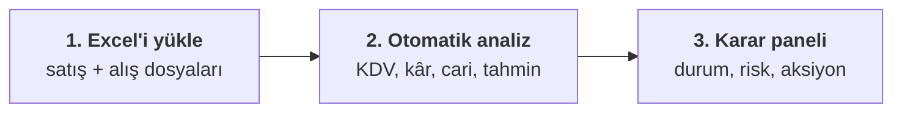
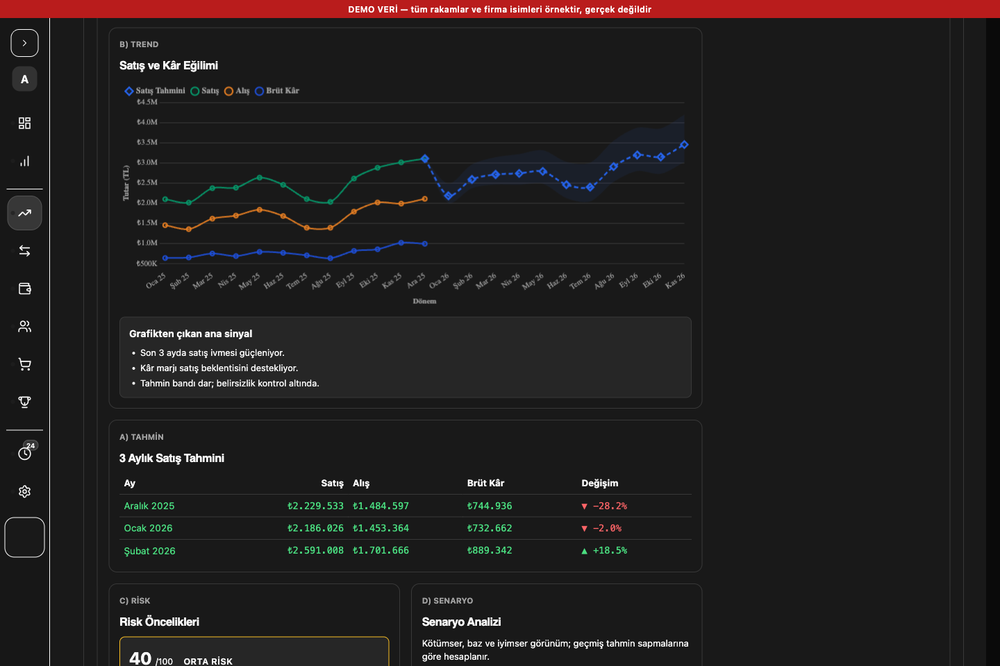
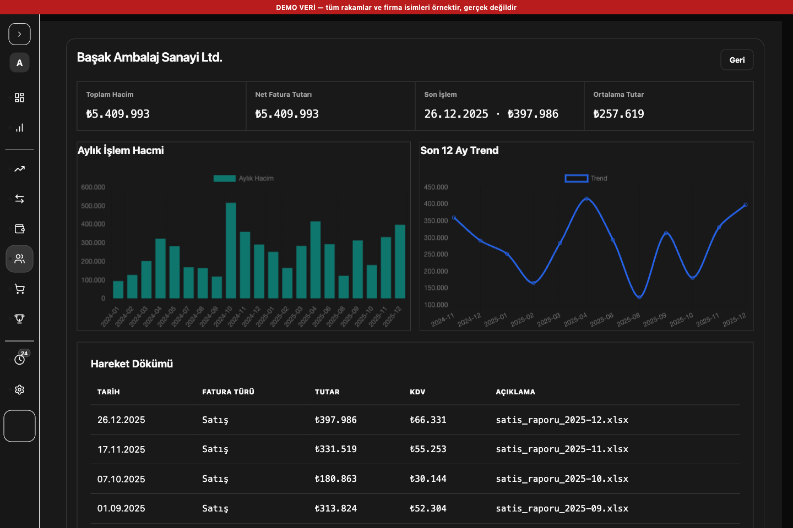
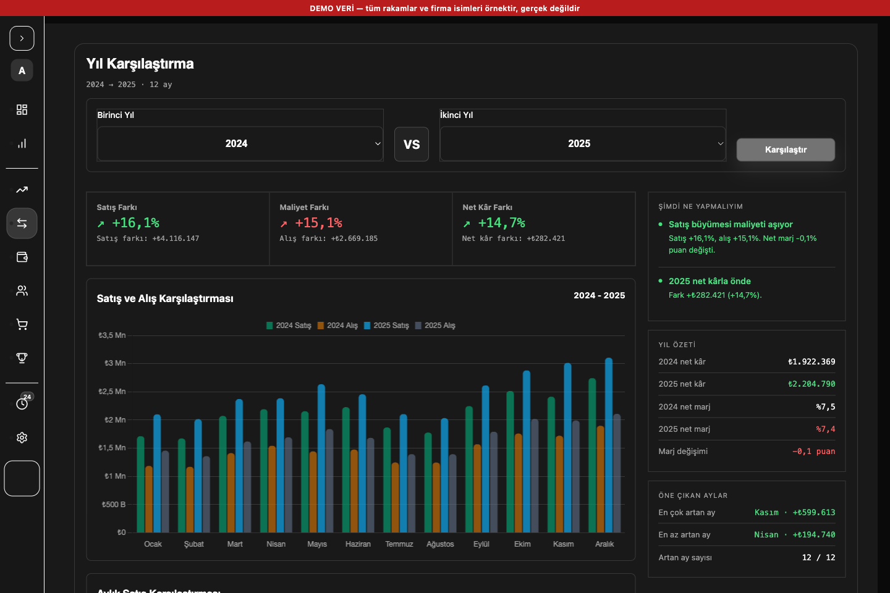
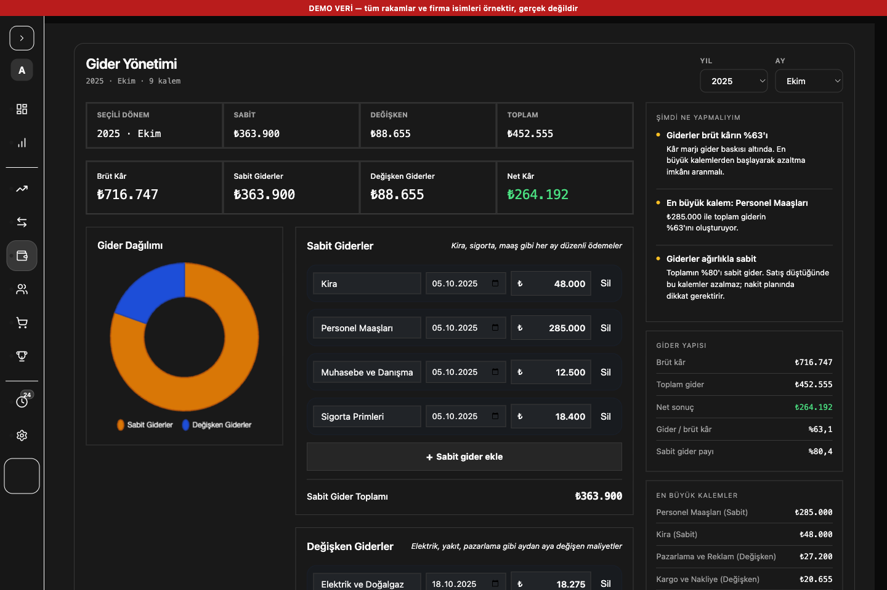
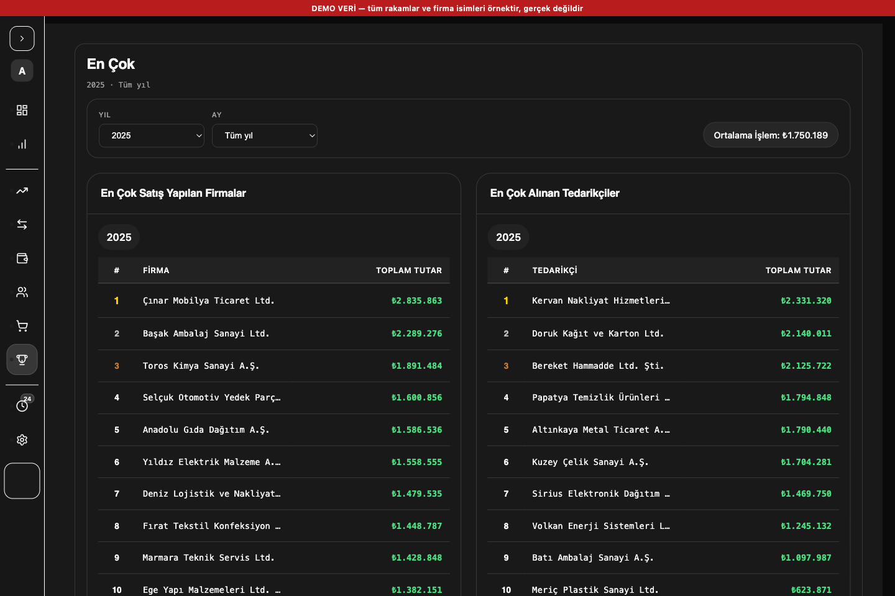

<div align="center">

# Analizcim

**Excel'deki satış ve alış dosyalarınızı, "şimdi ne yapmalıyım?" sorusuna cevap veren bir karar paneline çevirir.**

Tamamen kendi bilgisayarınızda çalışır. Finansal verileriniz hiçbir yere gönderilmez.

[](https://github.com/ademtfkc/analizcim/actions/workflows/ci.yml)
[](#geliştirme-ve-test)
[](#kurulum-ve-çalıştırma)
[](#kimler-için)
[](LICENSE)


</div>

> ⚠️ **Bu sayfadaki tüm ekran görüntüleri demo veriyle üretilmiştir.** Rakamlar ve firma isimleri
> uydurmadır, gerçek bir işletmeye ait değildir. Görsellerin üstündeki kırmızı bant bunu belirtir.

## İçindekiler

- [Nasıl çalışır?](#nasıl-çalışır)
- [Neler yapar?](#neler-yapar)
- [Kimler için?](#kimler-için)
- [Ekranlar](#ekranlar)
  - [Panel (Dashboard)](#panel-dashboard)
  - [Tahminler](#tahminler)
  - [Müşteriler ve Tedarikçiler](#müşteriler-ve-tedarikçiler)
  - [Cari detay](#cari-detay)
  - [Yıl Karşılaştırma](#yıl-karşılaştırma)
  - [Gider Yönetimi](#gider-yönetimi)
  - [En Çok](#en-çok)
- [Kurulum ve Çalıştırma](#kurulum-ve-çalıştırma)
- [Teknolojiler](#teknolojiler)
- [Proje Yapısı](#proje-yapısı)
- [Tahmin Motoru](#tahmin-motoru)
- [Geliştirme ve Test](#geliştirme-ve-test)
- [Lisans](#lisans)

## Nasıl çalışır?



Dosyanın dönemi adından okunur (`satis_raporu_2025-10.xlsx`). Sütun başlıkları esnek eşlenir; aynı
dosya ikinci kez yüklendiğinde mükerrer kayıt oluşmaz.

## Neler yapar?

| | Özellik | Ne işe yarar |
|---|---|---|
| 📊 | **Panel (Dashboard)** | 4 ana KPI, mikro grafikler, Kâr/Zarar tablosu ve veriden üretilen aksiyon maddeleri |
| 🔮 | **Tahminler** | 4 model (Linear, Exponential Smoothing, Holt-Winters, ARIMA) karşılaştırılır, en düşük hatalı olan seçilir |
| 🔁 | **Yıl Karşılaştırma** | İki yıl arası satış/maliyet/net kâr farkı, aylık kırılım ve grafik |
| 👥 | **Cari yönetimi** | Satış dosyasından müşteri, alış dosyasından tedarikçi otomatik çıkarılır; manuel kartlar da tutulur |
| 💳 | **Gider yönetimi** | Sabit/değişken gider ayrımı, gider dağılımı ve net kâra etkisi |
| 🏆 | **En Çok** | Yıl ve ay bazında en yüksek hacimli firma ve tedarikçi sıralaması |
| 🧭 | **Kokpit arayüzü** | Her sayfada solda içerik, sağda "Şimdi ne yapmalıyım" karar paneli |
| 📤 | **Dışa aktarma** | PDF ve Excel çıktısı; geçmiş analizler, çöp kutusu ve arşiv |
| 🌓 | **Dark / light tema** | Mobil ve tablette de kullanılabilir; cari listesi telefonda kart görünümüne döner |
| 🔐 | **Kullanıcı yönetimi** | Giriş, admin onay akışı, rol yönetimi ve tema uyumlu onay pencereleri |

## Kimler için?

- Küçük işletme sahipleri
- Muhasebe ve finans kullanıcıları
- Kendi Excel verisini daha anlaşılır analiz etmek isteyenler

## Ekranlar

### Panel (Dashboard)


İşletmenin finansal görünümünü hızlı karar alınabilecek biçimde sunar. Üstte **4 ana KPI kutusu** yer alır:

- **Toplam Satış · Toplam Alış · Net Kâr · Ödenecek KDV** — her biri yıllık değişim rozeti ve aylık
  mikro grafikle birlikte. (Ödenecek KDV kutusunda yıllık değişim rozeti bulunmaz: bu rakam devreden
  KDV mahsuplu bir defterden gelir, önceki yıl için aynı defter kurulmadan yapılacak kıyas yanıltıcı olurdu.)
- Bunların altındaki ikincil şeritte **Brüt Kâr · Toplam Analiz · Toplam Gider · Toplam Müşteri ·
  Toplam Tedarikçi** durur. Müşteri ve tedarikçi çipleri ilgili sekmeye gider.

Ana sahnede net kâr özeti ve trend grafiği; altında Kâr/Zarar tablosu ve finansal sağlık göstergeleri
bulunur. Sağdaki karar panelinde "Şimdi ne yapmalıyım" maddeleri, önümüzdeki 3 ay tahmini, KDV özeti
ve cari özeti yer alır.

> **Brüt Kâr KDV hariç hesaplanır** (KDV devlete ödenecek geçiş kalemidir, kâr değildir).
> "Toplam Satış/Alış" ise fatura toplamı olarak KDV dahil gösterilir.

### Tahminler


Aylık satış verisi üzerinde birden fazla istatistiksel modeli karşılaştırır ve en düşük hatalı modeli
otomatik seçer. Sayfada muhasebeci feedback kartı, 1/3/6/12 ay horizonları, güven aralıklı ana grafik,
model karşılaştırma tablosu, risk/senaryo alanları, aksiyon planı ve CFO analizi bulunur.

Kart düzeni sabittir (grafik → tablo → risk+senaryo → finansal sağlık+büyüme → karar etkisi+aksiyon →
CFO); yan yana duran kartlar aynı yükseklikte hizalanır.



*Yukarıdaki grafikte model elle **Holt-Winters** seçilmiştir; kesikli çizgi tahmini, gölgeli alan ise
%80 güven aralığını gösterir.*

### Müşteriler ve Tedarikçiler


İki katmanlı bir yapı vardır:

- **Manuel müşteri yönetimi:** kullanıcı kendi müşteri kartlarını ekler/düzenler/siler.
- **Excel tabanlı cari analizi:** satış dosyalarından **müşteri**, alış dosyalarından **tedarikçi**
  isimleri otomatik çıkarılır.

Desteklenen karşı taraf başlıkları (varyasyonlarıyla): `Müşteri Adı`, `Müşteri`, `Cari Adı`,
`Cari Unvan`, `Cari Hesap`, `Cari Ünvanı`, `Tedarikçi`, `Tedarikçi Adı`, `Firma Ünvanı`, `Açıklama`.
Cari/müşteri/tedarikçi başlıkları, genel açıklama/ürün kolonlarına göre önceliklidir. Her hareket için
tarih, tutar, KDV, dosya kaynağı ve fatura yönü saklanır.

Liste masaüstünde tablo, telefon/tablette (≤768px) yatay kaydırma yerine kart görünümüdür.

> **Not (bakiye kavramı):** Listelerdeki **"Fatura Toplamı"** kesilen faturaların toplamıdır —
> ödenmemiş bakiye DEĞİLDİR. Uygulamada tahsilat/ödeme kaydı kavramı yoktur, dolayısıyla bu rakamdan
> hiçbir ödeme düşülmez. Gerçek borç/alacak takibi ayrı bir özellik olarak ele alınmalıdır.

> **Not (geçmiş veriler):** Cari listesi yalnızca **yeni yüklenen** Excel dosyalarından otomatik
> dolar. Bu özellik eklenmeden önce yüklenmiş eski analizler cari listesine **otomatik girmez**.
> Eski verileri de cari'ye katmak için ilgili Excel dosyalarını **yeniden yükleyin** — aynı dosya
> tekrar yüklendiğinde mükerrer hareket oluşmaz (benzersiz kaynak anahtarı + `INSERT OR IGNORE`).

### Cari detay



Tek bir müşteri veya tedarikçinin künyesi: toplam hacim, net fatura tutarı, son işlem tarihi ve tutarı,
ortalama işlem tutarı, aylık hacim grafiği, son 12 ay trendi ve tam hareket dökümü (tarih, fatura türü,
tutar, KDV ve hangi dosyadan geldiği).

### Yıl Karşılaştırma



İki yıl arasındaki performansı gösterir: Satış/Maliyet/Net Kâr Farkı için 3 YoY delta kartı,
Ocak-Aralık grouped bar chart ve Toplam satırlı aylık karşılaştırma tablosu. Sağ panel yıl özetini ve
öne çıkan ayları verir.

### Gider Yönetimi



Sabit giderler (kira, maaş, sigorta gibi her ay düzenli ödemeler) ile değişken giderler (elektrik,
yakıt, pazarlama) ayrı tutulur. Sayfa seçilen dönemin brüt kârını, toplam giderini ve net kârını aynı
ekranda gösterir; sağ panel gider yapısını ve en büyük kalemleri sıralar.

### En Çok



Seçilen yıl ve ay için en yüksek hacimli firmalar ve tedarikçiler. Ay filtresi `Tüm yıl` veya 1-12
değerini alır ve her iki listeye birden uygulanır.

## Kurulum ve Çalıştırma

**Gereksinimler:** Node.js 18+ ve npm.

```bash
npm install
cp .env.example .env
# .env dosyasını açıp SESSION_SECRET değerini güçlü ve rastgele bir değerle değiştirin.
# (öneri: node -e "console.log(require('crypto').randomBytes(48).toString('hex'))")
npm start
```

Uygulama varsayılan olarak `http://localhost:3000` adresinde çalışır.

**İlk admin hesabı:** Sistemde admin yoksa, bootstrap değişkenleriyle bir admin oluşturulur
(değerler `.env.example` içinde açıklanmıştır):

```bash
BOOTSTRAP_ADMIN_USERNAME=admin BOOTSTRAP_ADMIN_PASSWORD='kendi-guclu-parolaniz' npm start
```

## Teknolojiler

| Katman | Kullanılan |
|---|---|
| Sunucu | Node.js, Express 4 |
| Veritabanı | SQLite (sqlite3) |
| Oturum / Güvenlik | express-session, bcrypt, express-rate-limit, CSP + güvenlik başlıkları |
| Excel / Dışa aktarma | xlsx, jsPDF, jspdf-autotable |
| Tahmin | arima (native ARIMA/SARIMA) |
| Loglama | pino |
| Arayüz | Vanilla JS + HTML/CSS (build adımı yok), Chart.js |

## Proje Yapısı

```text
analizcim/
├── src/                 # Sunucu tarafı (backend)
│   ├── server.js        # Express sunucusu, oturum, güvenlik başlıkları, rotalar
│   ├── analyzer.js      # Excel ayrıştırma, satış/alış/KDV/kâr hesabı, cari eşleme
│   ├── predictor.js     # Tahmin motoru (Linear, Exp. Smoothing, Holt-Winters, ARIMA)
│   ├── storage.js       # Veri erişim katmanı (SQLite)
│   ├── database.js      # DB bağlantısı ve şema
│   ├── validators.js    # Girdi doğrulama + yardımcılar
│   ├── routes/          # API rota modülleri (auth, history, customers, ...)
│   └── middleware/      # auth (yetki) + rate-limiters (hız sınırı)
├── public/              # Frontend (build adımı yok)
│   ├── index.html, login.html
│   ├── app.js, styles.css
│   ├── js/              # küçük ön yüz modülleri
│   └── vendor/          # chart.umd.min.js
├── scripts/
│   └── migrations/      # sıralı DB şema değişiklikleri (001..010)
├── tests/               # unit, integration, helpers
├── data/                # yerel SQLite DB + yedekler (git'e girmez)
├── docs/                # api.md, openapi.json, screenshots/
└── package.json
```

## Tahmin Motoru

`src/predictor.js` aylık satış verisini temel alır:

- Modeller: Linear Regresyon, Exponential Smoothing, Holt-Winters, ARIMA (`arima` npm paketi).
- Her model rolling backtest ile ölçülür; MAE/RMSE (mümkünse MAPE) hesaplanır.
- Otomatik modda en düşük RMSE'li model seçilir; manuel modda kullanıcı modeli belirler.
- 24+ aylık veride seasonal ARIMA adayı da değerlendirilir.
- Veri yetersizse model `available: false` döner ve kullanıcıya anlamlı bir neden gösterilir.

API örnekleri:

```text
GET /api/predictions?period=12&model=auto
GET /api/predictions?period=all&model=arima
```

Desteklenen `period`: `6`, `12`, `all` · Desteklenen `model`: `auto`, `linear`, `exponentialSmoothing`,
`holtWinters`, `arima`.

## Geliştirme ve Test

```bash
npm start                 # uygulamayı başlat
npm run lint              # eslint
npm test                  # tüm testler
npm run test:unit         # birim testleri
npm run test:integration  # entegrasyon testleri
npm run test:smoke        # smoke testi
npm run verify:fast       # lint + unit + smoke
npm run verify            # lint + unit + integration + smoke
```

Son doğrulanan durum: **179 birim + 36 entegrasyon + 1 smoke** testi geçiyor, lint temiz.

- Güvenli lokal QA, sürüm geçmişi ve tur notları için bkz. [CHANGELOG.md](CHANGELOG.md).
- Soket açma izni gerektiren bazı entegrasyon testleri kısıtlı ortamlarda temiz kapanmayabilir; tekil
  çalıştırılabilir.

## Lisans

ISC — bkz. [LICENSE](LICENSE).
